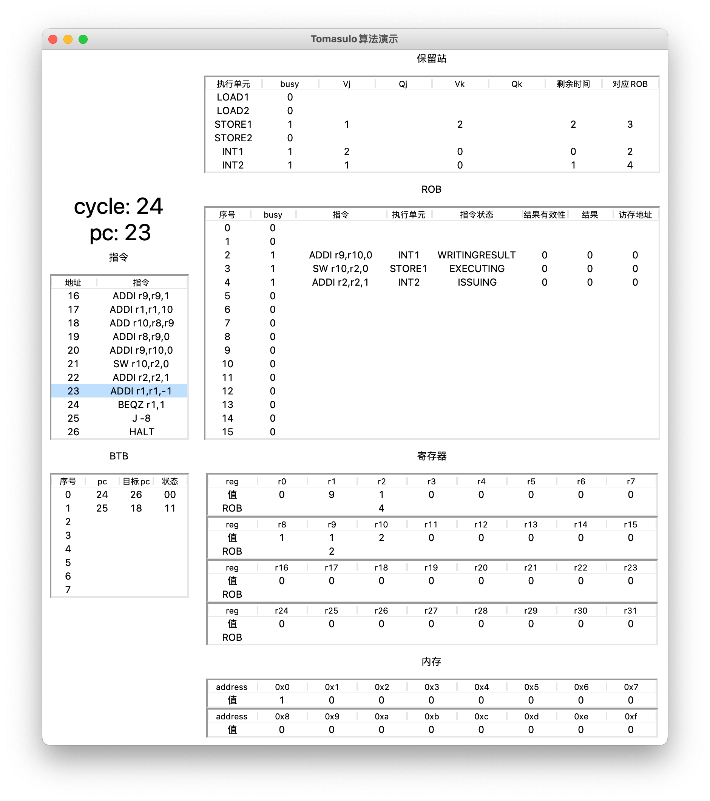

##Toamsulo实验报告
计95 李骁 201901314

###说明
文件树如下
```shell
Tomasulo
├── display.py
├── gui_demo.png
├── report.md
├── run.sh
├── sample
│   ├── input1.asm
│   ├── input2.asm
│   └── input3.asm
├── template.c
└── translater.py
```
其中```report.md```，即本文件是实验报告，```sample```文件夹下包含了几个汇编代码文件用来测试，```gui_demo.png```是可视化界面的一张截图，其他的文件就是具体的代码部分了。

实验环境是macOS，实测linux环境下也可以执行。python版本为3.8 / 3.9。

本次实验中，我实现了要求的所有功能，包括一个简单的[汇编器](translater.py)，带分支预测的[Tomasulo算法模拟器](template.c)以及模拟结果的[图形化展示界面](display.py)，另外还有一个简单的[shell文件](run.sh)用来顺序执行这三个程序，实现汇编代码到图形界面的一步到位操作。

下面具体描述每个部分的实现与具体的使用方式。

###汇编器
汇编器的逻辑比较简单，就是把每行汇编代码按照格式要求翻译成机器码。当然，翻译的过程要考虑每两个参数之间是否有空格，每行是否有注释等情况，这些是繁琐的字符串处理操作，不在此赘述。

大致的流程便是做两次遍历，第一次遍历获取所有label的地址，如下面这段代码里的```loop```和```end```:
```c
     addi r1,r1,1      ;set r1=1
     addi r10,r10,10   ;set r10=10, r10 is counter
loop addi r1,r1,3      ;r1 += 3
     addi r10,r10,-1   ;counter --
     beqz r10,end      ;loop
     j loop
end  halt
```
第二次遍历实现每行代码的翻译，分支和跳转代码也可以根据第一次遍历得到的信息计算出跳转的偏移量进行翻译，比如```j loop```中的```loop```会被改为实际偏移量2。

汇编器的代码是用```python```语言编写的，实现在[translater.py](translater.py)中，它的参数有两个，分别是输入的汇编代码文件路径和输出到的机器码文件路径。具体的使用方式如下：
```shell
$ python3 translater.py asm_file mcode_file
```

###Tomasulo模拟器
模拟器是在给出的模版代码的基础上修改的。主要的部分是发射指令、提交ROB、处理保留站、分支预测，下面分别阐述。

#####发射指令
只要满足ROB和保留站都有满足该指令的空间，就可以选择发射该指令。

具体的步骤是看ROB的```tail```加一之后是否和```head```相同。如果是相同的，说明ROB已经满了，因此不能发射。如果ROB没有满，再去查看保留站。保留站中分别设置了两个整数运算部件，写内存部件，读内存部件，每种指令需要不同的部件。如果保留站中该指令需要的部件有一个空的，就可以发射指令。发射指令要注意修改相应的保留站和ROB信息。

发射完毕也要更新```pc```从而方便发射下一条指令。需要注意的是因为实现了BTB，遇到分支指令要去查BTB，决定下一个```pc```如何更新；其他指令直接```pc+1```即可。

#####提交ROB
ROB每次只能提交一条指令。我们只要检查ROB的```head```对应的指令是否已经执行完毕，是否可提交即可。提交指令之后将```head+1```即可。

需要注意的是不同指令提交要做的事情是不同的。像```lw```,```add```这类指令，要做的是更新寄存器。这里要注意检查对应寄存器记录的ROB信息是不是指向自己，如果是的话要把寄存器的```valid```改成1，否则说明ROB中还有别的指令要修改这个寄存器，不能修改```valid```。另外像```sw```指令，提交要做的是把值写到对应内存。```beqz```和```j```指令是跳转指令，提交时要更新BTB，另外注意实际的跳转位置和计算出的跳转位置是否一致，不一致的话还要清空ROB，保留站和寄存器记录的ROB依赖信息等。```halt```指令提交时直接跳出主循环即可，模拟停机。

#####处理保留站
指令发射后，直到执行完成并把结果写到ROB之前，一直在保留站之内记录。每个周期对指令的执行状态进行更新，具体如下。

对于Writing Result状态，指令执行完毕，正在向ROB中写结果，这时候需要获得结果，并通过CDB把结果进行广播。具体就是遍历每个保留站，如果有保留站需要当前部件计算出来的结果，就给他，并将其```Qj```/```Qk```修改为0。最后把结果写入ROB，指令状态改为Committing。

对于Executing状态，指令正在执行，需要把指令剩余执行时间减1。如果减到0了，就把状态改为Writing Result。

对于Issuing状态，检查需要的数据是否已经准备好，也就是```Qj```/```Qk```是不是都是0。准备好的话，就把状态改为Executing。

#####分支预测
对于分支和跳转指令，在BTB中记录其跳转信息。下面分别介绍BTB更新和使用的过程。

BTB的更新是在ROB提交时进行的。当提交的指令是分支和跳转指令时，更新BTB。具体就是根据指令地址，跳转地址以及是否发生跳转来更新。如果BTB中没有这个表项，就插入一条，并将2位记录信息赋值为```跳转成功 ? 0b11 : 0b00```，BTB容量不足的话，采用FIFO策略进行替换。如果表项已经存在，则根据是否发生跳转和状态转移图来修改2位记录信息。

BTB的使用是在发射分支和跳转指令来进行的。通过查BTB表中记录的跳转地址和2位记录信息，决定下一个```pc```是多少。

Tomasulo模拟器的代码实现在[template.c](template.c)中，它的参数有一个，就是翻译过的机器码的文件路径。直接执行的话输出的结果较多，可以选择把输出结果重定向到文件中方便检查以及可视化。可以如下方式执行：
```shell
$ gcc template.c
$ ./a.out mcode_file > result.txt
```

###图形化展示界面
图形化界面的实现逻辑比较简单，就是将上一步Tomasulo模拟器输出的结果进行信息提取，把每个cycle中的所有信息使用表格展示出来。这里主要还是繁琐的字符串处理，不再赘述。在代码中创建了Cycle类和Cycle对象的列表，每个对象都会记录对应Cycle的所有信息。在切换Cycle时就可以实现所有信息的切换，从而可视化。

这部分代码是用```python```语言编写的，使用了```tkinter```库实现图形化界面，代码在[display.py](display.py)中。它的参数有一个，就是上一步Tomasulo输出结果文件的路径，执行如下：
```shell
$ python3 display.py
```
以下是界面的一个示例，在该界面使用小键盘的```←```和```→```来切换cycle。


###shell文件
[run.sh](run.sh)文件的内容如下：
```shell
#!/bin/sh

python3 translater.py $1 output.txt
gcc template.c
./a.out output.txt > result.txt
python3 display.py result.txt

rm output.txt
rm result.txt
rm a.out
```
就是简单的将上面介绍过的几个程序的运行方式组合了起来，参数是汇编代码的文件路径，数据就是可视化界面，可以按如下方式运行：
```shell
$ ./run.sh asm_file
```
当然也可以按照上面说的步骤一步步来运行。